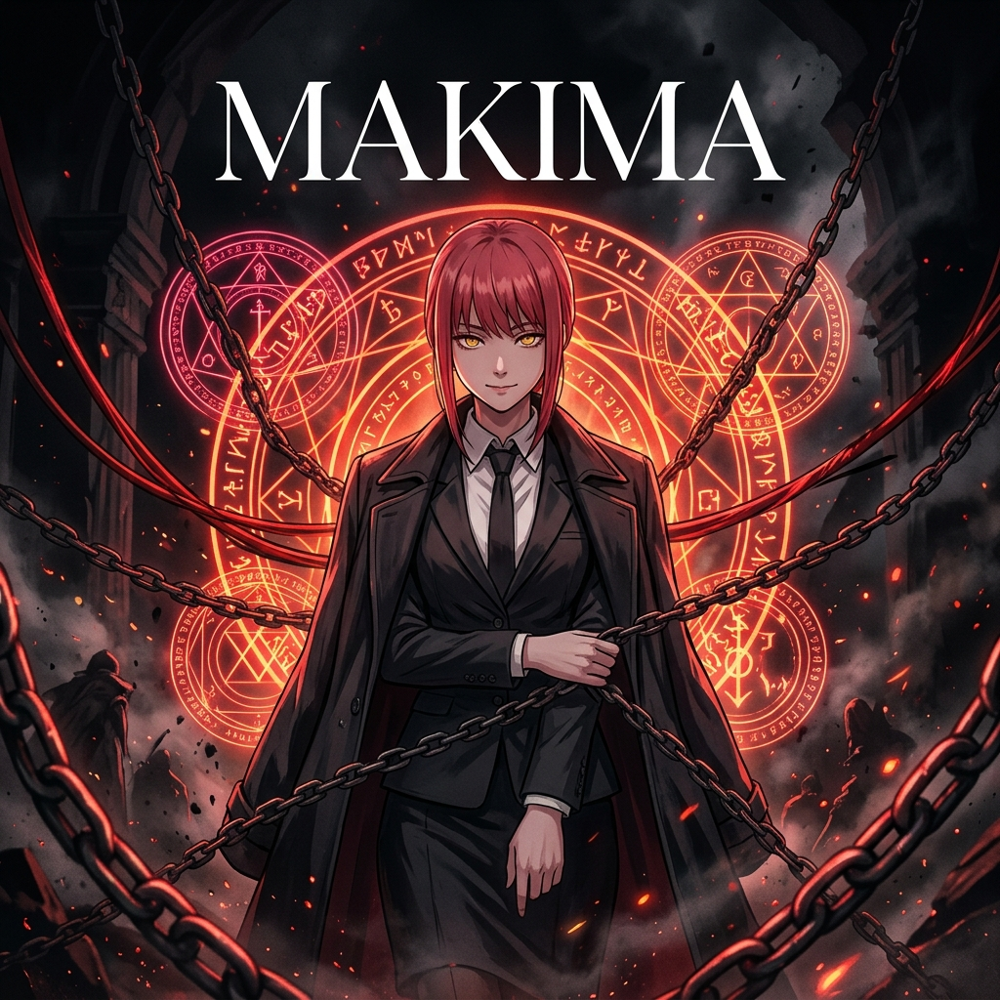
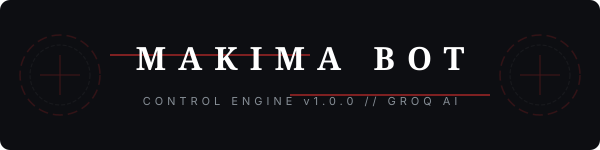

<p align="center">
  
</p>

<p align="center">
  <a href="https://github.com/xyanncat/Makima/issues"></a>
  <a href="https://github.com/xyanncat/Makima/stargazers"></a>
  <a href="LICENSE"></a>
  <a href="https://render.com"></a>
</p>

<p align="center">
  ⛓️ <b>"Everything in this world is under my control. You will be too."</b> ⛓️
</p>

<p align="center">
  A premium, high-performance, multi-platform AI live stream chatbot styled after the commanding persona of <b>Makima</b> from <i>Chainsaw Man</i>. Running exclusively on the ultra-fast <b>Groq API</b>, it automatically connects to and controls chatrooms on <b>Twitch</b>, <b>YouTube Live</b>, and <b>Kick</b> simultaneously.
</p>

---

## 👁️ Core Directives (Features)

<table width="100%">
  <tr>
    <td width="33%" align="center">
      <b>🐕 The Obedience Engine</b><br>
      <i>Highly realistic Makima persona: polite, refined, dominant, and chilling. Zero emojis. Zero exclamation marks. Absolute control.</i>
    </td>
    <td width="33%" align="center">
      <b>⚡ Light-Speed Groq AI</b><br>
      <i>Utilizes Groq API with instant model fallbacks. Swaps from <b>Llama 3.1 70B</b> to <b>8B</b> instantly if rate-limits or outages are encountered.</i>
    </td>
    <td width="33%" align="center">
      <b>📈 Live Analytics Board</b><br>
      <i>A gorgeous glassmorphism status web interface serving real-time connection telemetry and live console log feeds.</i>
    </td>
  </tr>
</table>

---

## ⛓️ Platform Integration Matrix

| Platform | Chat Listener | Chat Sender | Authentication Required |
| :--- | :--- | :--- | :--- |
|  | **LiveChat Listener** (`youtube-chat`) | **Google API Client** | OAuth2 Client ID & Refresh Token |

---

## ⚙️ Deployment & Variables

To boot the bot, configure the following variables inside a local `.env` file or in your **Render Environment Configuration**:

### System Config
*   `PORT`: Port of the express telemetry server (default `3000`).
*   `RENDER_EXTERNAL_URL`: Public URL of your deployed Render app (e.g. `https://makima.onrender.com`). Enables the optional in-process health check; it is not a guaranteed keep-alive mechanism.

### AI Settings
*   `GROQ_API_KEY`: Your Groq Cloud access key.
*   `GROQ_PRIMARY_MODEL`: Defaults to `llama-3.1-70b-versatile`.
*   `GROQ_FALLBACK_MODEL`: Defaults to `llama-3.1-8b-instant`.
*   `COMMAND_PREFIX`: Chat command trigger; defaults to `!`.

<details>
<summary><b>🔑 Click to view Platform Connection Config</b></summary>

```ini
# YouTube settings
# Public channel mode: the channel ID is the only selector required.
YOUTUBE_CHANNEL_ID=UCxxxxxxx
YOUTUBE_RATE_LIMIT_WINDOW_SEC=10
YOUTUBE_CLIENT_ID=xxxxxxxxxxxx.apps.googleusercontent.com
YOUTUBE_CLIENT_SECRET=gsecs_xxxxxxxxx
YOUTUBE_REFRESH_TOKEN=1//0xxxxxxxxx
```
</details>

With `YOUTUBE_CHANNEL_ID` configured, the app uses the authenticated YouTube Data API to find the channel's active public live video and then starts the `youtube-chat` listener for that discovered stream. No video ID or channel handle is required.

---

## ⚡ Setup & Launch

```bash
# 1. Clone repository
git clone https://github.com/xyanncat/Makima.git
cd Makima

# 2. Install dependencies
npm install

# 3. Setup credentials
cp .env.example .env
# (Fill in your Groq API key and credentials)

# 4. Generate YouTube Refresh Token (If using YouTube)
npm run get-yt-token

# 5. Run in Development
npm run dev

# 6. Build and Start Production
npm run build
npm start
```

---

## 🩸 Render Deployment

1. Create a **Web Service** on [Render](https://dashboard.render.com/) linked to your repository.
2. Build Settings:
   *   **Runtime:** `Node`
   *   **Build Command:** `npm install && npm run build`
   *   **Start Command:** `npm start`
   *   **Instance Type:** `Free`
3. Add your environment variables in the **Environment** tab. Make sure `RENDER_EXTERNAL_URL` points to your public Render service domain.
4. The server performs a best-effort health check every 10 minutes through `/health`. This confirms the app responds, but an app cannot reliably keep its own Render instance awake by pinging itself. For reliable wake-up monitoring, configure an external uptime monitor to request `https://<your-service>.onrender.com/health`. Render may still sleep or restart free instances according to its platform rules.
