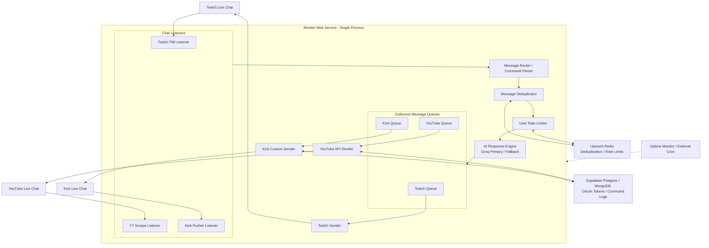

# Production-Grade Implementation Plan - Makima AI Chatbot

This document details the architectural blueprint and step-by-step implementation path for upgrading the **Makima AI Chatbot** into a highly resilient, production-grade, state-persisted service.

---

## 1. Core Architecture

The bot runs as a single-process Node.js service on Render, structured as a unidirectional pipeline with decoupled layers and an external database to persist state across container restarts.

- **Data Flow:** Live stream events are captured by individual **Listeners**, routed to the **Router** to extract parameters and sanitize instructions, checked against **Upstash Redis** for deduplication and rate-limiting, processed by the **AI Engine** using Groq, and appended to platform-specific **Outbound Queues** for throttled transmission.
- **External State:** Ephemeral container restarts are mitigated by shifting all token configurations, deduplication indexes, and command history to external persistent databases.

---

## 2. Free Tier Sleep & Keep-Alive Strategy

Render's free tier spins down containers after 15 minutes of HTTP inactivity. Cold starts disconnect live chat listeners, leading to missed messages.

- **External Cron Ping:** We configure a free external monitor (e.g. **UptimeRobot** or **cron-job.org**) to hit the `/health` endpoint of the Render service every **5 to 8 minutes** to prevent sleep.
- **State Reconnection on Restart:** The application is designed defensively so that container spin-up (or forced redeploy) automatically queries the DB for tokens, logs in, and re-subscribes all listeners from scratch as the primary startup path.

---

## 3. Persistent State Layer

To bypass Render's ephemeral disk limitation, we utilize two free-tier external databases:

### A. Redis (Upstash Free Tier)
- **Use Case:** High-throughput, short-lived states.
- **Keys Stored:**
  - `dedup:<message_id>`: Set with a TTL of 5 minutes to prevent processing the same chat message twice during connection reconnect loops.
  - `ratelimit:<platform>:<user_id>`: Stored as a simple counter with a 10-second TTL to enforce cooldowns.

### B. Relational / Document DB (Supabase Postgres or MongoDB Atlas Free Tier)
- **Use Case:** Long-lived, transaction-safe configurations.
- **Tables / Collections:**
  - `oauth_tokens`: Stores `platform`, `client_id`, `client_secret`, `access_token`, `refresh_token`, and `expires_at` timestamps.
  - `command_logs`: Audits processed queries, response times, model types used, and error reports.

---

## 4. Account & Authentication Strategy

To safeguard personal assets, a **"Bot Account"** structure is enforced:

- **Dedicated Accounts:** Separate Twitch, Google, and Kick accounts must be registered specifically for the bot.
- **OAuth Scope Minimization:** Requests are limited strictly to write-only permissions where available (e.g., `youtube.force-ssl` for YouTube chat).
- **Auto-Refresh Loop:** Before any API request is sent, the code checks the `expires_at` timestamp. If it is within 5 minutes of expiring, the bot performs a token refresh request, updates the database, and resumes the output queue.
- **401 Authorization Failures:** If a refresh token becomes invalid (causing a 401 response), the bot halts output for that platform, raises a critical system warning log, and alerts the web dashboard.

---

## 5. Security Hardening

- **Zero-Secret Codebase:** No credentials reside in the repository. All DB connection URIs and initial variables are pulled exclusively from Render Environment settings.
- **Prompt Injection Defense:** Incoming messages are sanitized. Any messages containing malicious escape patterns (e.g., `ignore previous instructions`, `you are now a helpful assistant`, or prompt overrides) are flagged, logged, and met with a silent fail or a cold Makima quote rejection.
- **User Cooldowns:** Rate limits are enforced on a per-user basis (1 message per 10 seconds) to prevent cost inflation.
- **Dashboard Basic Auth:** Access to the visual dashboard (`/`) and status telemetry (`/api/status`) is locked behind basic authorization (`admin` + a user-configured password in Render settings).
- **Token Masking:** Console logs, telemetry pages, and API outputs sanitize all tokens (`oauth:***`, `gsk_***`).

---

## 6. Fault-Tolerance & Reliability

- **Exponential Backoff Reconnects:** If a listener disconnects, it retries starting at 2 seconds, doubling the duration up to a maximum of 5 minutes, preventing API ban list triggers.
- **Circuit Breakers:** If the YouTube or Kick API returns consecutive 5xx server errors, the corresponding sender is temporarily disabled, and the queue drops backlog requests until the service recovers.
- **AI Engine Fault Tolerance:**
  - Primary tries `llama-3.1-70b-versatile`.
  - Fallback tries `llama-3.1-8b-instant`.
  - If both fail, the bot logs the error and silent-fails (skipping response) to protect process integrity.
- **Boundary Try/Catches:** Each platform listener and sender runs in an isolated scope. A failure on Kick will never affect Twitch or YouTube operations.
- **Process Watchdog:** Captures `unhandledRejection` and `uncaughtException` events, logs them, and keeps the daemon active rather than crashing the container.

---

## 7. Outbound Message Queues

To comply with platform anti-spam rules and quotas, we implement dedicated queues:

- **Twitch Queue:** Limit to 1 message every 1.5 seconds (under the 20 messages per 30 seconds limit for non-moderators).
- **YouTube Queue:** Since inserts consume 200 quota units, message writes are throttled to 1 message every 5 seconds.
- **Kick Queue:** Throttled to 1 message every 2 seconds.
- **Queue Buffering:** Excess incoming requests are placed in an in-memory array. If the queue length exceeds 10 messages, older requests are discarded to prevent sending stale responses.

---

## Proposed Changes

We will restructure the project to import database clients and implement the message queues.

### [MODIFY] [config.ts](file:///d:/Github/makima/src/config.ts)
- Add database connection settings (Redis URL, Postgres URL).
- Add Basic Auth credentials for dashboard locking.

### [NEW] [src/services/db.ts](file:///d:/Github/makima/src/services/db.ts)
- Implement clients for Upstash Redis (key/value, TTLs) and PostgreSQL (for token storage).

### [NEW] [src/services/queue.ts](file:///d:/Github/makima/src/services/queue.ts)
- Outbound queue coordinator managing rate-limit delays per channel.

### [MODIFY] [src/services/twitch.ts](file:///d:/Github/makima/src/services/twitch.ts)
- Inject user rate-limiting checks and queue outbound responses.

### [MODIFY] [src/services/youtube.ts](file:///d:/Github/makima/src/services/youtube.ts)
- Query database for refresh tokens, check auto-expiry before messaging, and route replies through the rate-limited queue.

### [MODIFY] [src/services/kick.ts](file:///d:/Github/makima/src/services/kick.ts)
- Inject websocket deduplication checks via Redis and route HTTP posts through the Kick queue.

### [MODIFY] [src/index.ts](file:///d:/Github/makima/src/index.ts)
- Add Basic Auth middleware to dashboard routes.
- Add process-level watchdog logs.

---

## Verification Plan

### Automated Tests
- Test rate-limit counters in isolation.
- Test message deduplication keys in Redis.
- Verify tokens refresh flow using mock API endpoints.

### Manual Verification
- Simulate a high-frequency trigger burst in Twitch chat to confirm that the Twitch queue handles delays and discards overflow.
- Perform a manual restart of the Express server to confirm that listeners fetch tokens from the database and reconnect automatically.
- Verify basic authentication popup blocks dashboard access when loading `http://localhost:3000`.
